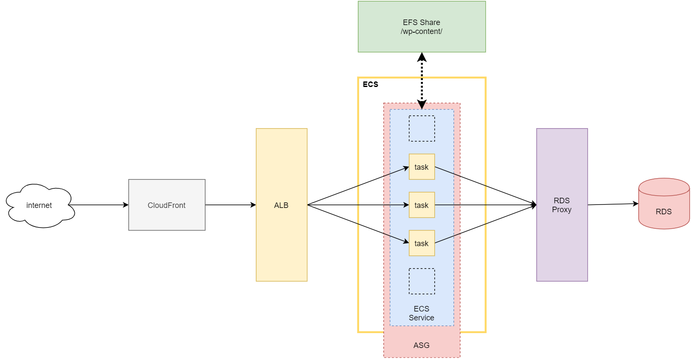

# Limble-Demo

## Requirements
- Build an archiecture to host a Wordpress application
- Use either ECS or EKS
- Emphasis on performance
- Single-region, multi-AZ
- Publicly accessible

## Architecture

### Design Decisions

#### ECS vs EKS
I elected to use ECS for this demo for a few reasons:
- ECS is perfectly adequate for the use case
- While Fargate is available for EKS, the implementation is not the greatest and I wanted to keep things as simple as possible
- I have had bad experiences with EFS as a Persistent Volume provider in Kubernetes and didn't want to have to go down that rabbit hole

#### RDS Proxy
With a focus on site performance I opted to try and avoid one of the major bottlenecks of applications: the database. Opting to use RDS proxy allows for a few niceties like connection pooling. When using an application you haven't written, you never know how the app will handle database availability, and so using RDS proxy allows us to sidestep any potential issues with database availabilty intermittance. When it comes time to scale the database from a single node to multiple via replicas, RDS consolidates those DB connections and makes choosing which replica to connect with transparent to the application, allowing the infra teams to scale without needing application changes.

#### EFS
While a lot of Wordpress' configuration is stored in the database, Wordpress also stores critical resources on its local filesystem. The various containers needed a way to share these files so that media uploaded to one app instance is available for the other running app instances. While S3 was the first things I thought of, I ultimately decided to go with EFS as -- again -- not knowing how the application fundtions "under the hood" when it comes to writing files, and with S3's inability to modify-in-place, I opted for a solution that acted closer to a local filesystem that could also be shared across the app containers. While there are plugins for Wordpress to run on S3, my approach was to utilize plugins and minimize the number of modifications to the underlying Wordpress base image.

#### TLS Termination
I chose to terminate TLS at CloudFront for this exercise to avoid having to provision a trusted public certificate. To do so would require me to provision an external domain for the demo stack and set up DNS for it through Route53. While doable, the brief I was given stated that a custom domain was not necessary, so I opted to termainte at CloudFront and use the CloudFront distribution domain as the TLD for this project.

### Overview

In general, the application architecture is as follows:
-   Cloudfront acts as a CDN and TLS termination point for the application, forwarding all traffic to an Application Load Balancer.
- The ALB target group points to the Wordpress ECS tasks, which are managed by an Autoscaling Group and are scaled based on CPU and Memory utilization
- The application containers connect to the MySQL database via RDS proxy, which proxies connections to RDS
- Shared files are stored on EFS and shared across all containers

Some important points to call out:
- All resouces are multi-AZ where possible. This includes DB, ALB, ECS subnets, EFS endpoints, RDS proxy, etc. 
- The ECS task currently pulls from Docker Hub; this could be moved to ECR as an early improvement

### Scaling

When evaluating this architecture for opportunities to scale beyond its current footprint, there are a number of ways to do this:

#### Within Region
- Scale instance types and sizes (vertical scaling)
- Set up resources in more AZ's to provide increased fault-tolerance 
- Set up RDS read replicas for read-heavy workload performance
- Move to the `php-fpm` version of Wordpress and split `apache` and `php` servers into separate services so they can be scaled independenly
- Optimize Cloudfront cache for better cache hit ratios

#### Multi-Region
- Move database to Aurora for true multi-master/multi-region replication
- Add GSLB (geo-weighted Route53) layer to application, letting users hit the closest available region
- Use replicated S3 buckets for sharing static content across regions instead of EFS

## Implementation

### Tools

I opted to use Terragrunt and Terraform for this project. I had not used Terragrunt prior to this project, but in my interview with the team we discussed their usage of it and felt adopting it for the demo project would be appropriate.

The Terraform config is broken into 4 Terragrunt modules:
- <b>wp-net</b> = handles all the underlying networking resources like vpc, security groups, subnets, etc.
- <b>wp-db</b> = all things database, including RDS proxy
- <b>wp-app</b> = the application layer with ECS configs, container defitions, etc.
- <b>wp-cdn</b> = the top level of the demo that sets up CloudFront

## Continued Development

Were I to continue developing this architecture beyond the 16-hour limit, there are a number of areas that I would like to implement:

### Security
While steps have been taken to provide the most basic amount of security to the application stack by isolating the application containers and the database from unwanted public traffic, there are a number of other steps that could be taken to improve the security posture of the application.

- End to end TLS encryption for all traffic
- Encrypt data at rest with EFS/S3 encryption
- Set up AWS WAF to monitor for unwanted application-layer traffic
- Enabled Shield on CloudWatch for DDoS protection and faster caching
- Set up more stringent NACL's and security groups (ex; only allow used ports within the VPC instead of an open rule)
- Set up GuardDuty to monitor security posture
- Integrate CloudCustodian to ensure compliance with resource policies

### Observability
One area that I didn't get to touch on as much as I would like is observability and monitoring. 
- Set up CloudWatch alarms for ALB and ASG metrics
- Set up VPC flow logs for network monitoring
- Set up ALB logs for access log monitoring
- Enable advanced CloudFront metrics (paid subscription)
- Enable RDS insights to monitor SQL-level metrics (slow queries, etc.)
- Add APM for the WP app

### IaC
With more experience in Terragrunt I'm sure I'll discover better ways to do some of the things I did, especially around sharing data between modules. I would like to explore this and see if there's more streamlined or different best practices that could be adopted.